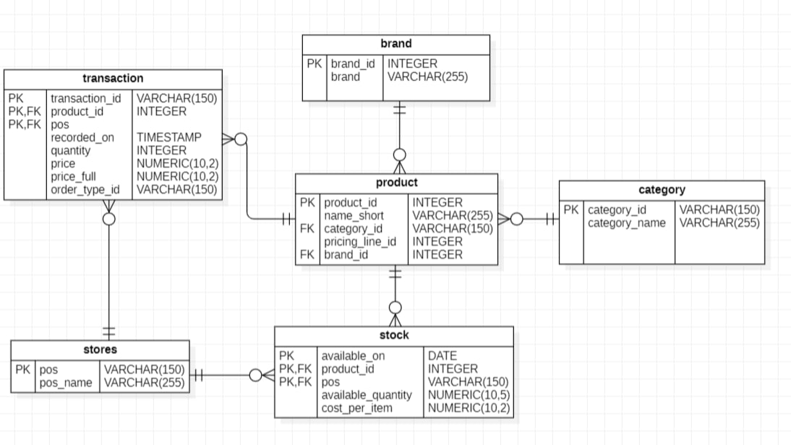
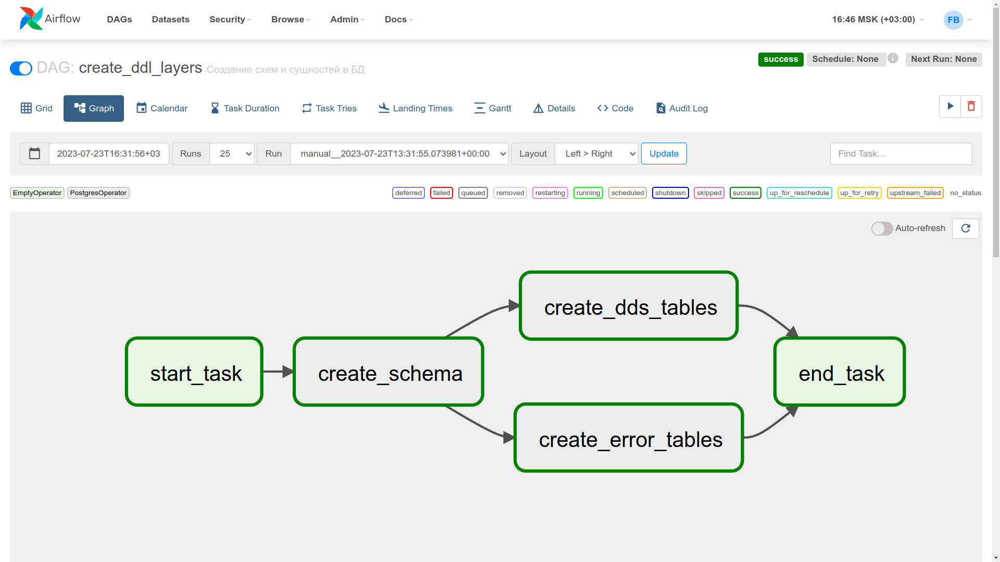
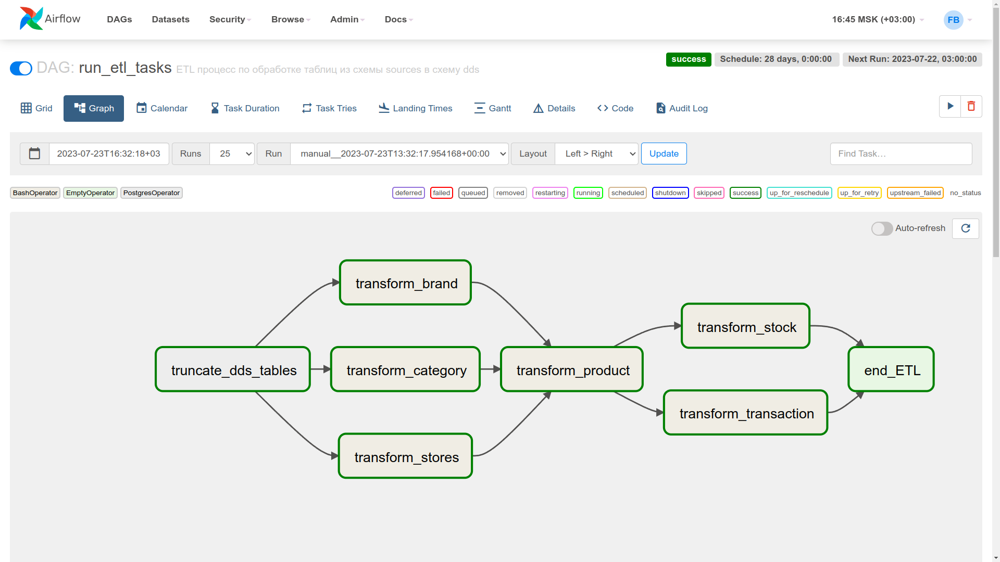

# КОРУС Консалтинг. Задания для разработчика 2, 3
> Стажёр-разработчик Георгий Новожилов \
> Системный аналитик Валентина Сорокина
> Команда 2

## 1. Описание
Задания: 
1. Написание DAG-ов для обработки таблиц из двух баз данных.
2. Разработка python-скрипта для загрузки, маппинга и фильтрации данных из источника в `dds`, согласно постановке от аналитика

- В процессе загрузки исправить все ошибки в данных, обнаруженные аналитиком
- Загрузку выполнять полной перезаписью данных в слое `dds`
- Обработку данных можно выполнять при помощи специализированной библиотеки (например, `pandas`), SQL-скриптов, либо обрабатывать чистым питоном
- Желательно минимизировать время недоступности слоя `dds` (время с момента удаления старых данных и до окончания записи новых). 
- Разработать `DAG` для запуска скрипта загрузки:  
- Отдельный скрипт, который считывает конфигурации и параметры подключения к БД и описывает задачу для запуска скрипта загрузки с нужными параметрами.  

ER-диаграмма БД **internship_2_db**:


(Тип данных transaction.pos - VARCHAR(150))

## 2. Структура
[**./crud/**](crud/) - Скрипты для обработки данных из таблиц \
[**./dags/dag_ddl_layers.py**](dags/dag_ddl_layers.py) - DAG, создающий схемы и сущности в БД команды \
[**./dags/dag_operate.py**](dags/dag_operate.py) - DAG, реализующий ETL процесс. Использует скрипты из папки crud/ \
[**./dags/dag_select.py**](dags/dag_select.py) - DAG, выполняющий SELECT. (Задание 2). Сохраняет полученные датафреймы в `./output`

Ниже представлена структура и приложены скриншоты успешного выполнения DAG-ов:
```
├── crud
│   ├── __init__.py
│   ├── dds_brand.py
│   ├── dds_category.py
│   ├── dds_product.py
│   ├── dds_stock.py
│   ├── dds_stores.py
│   └── dds_transaction.py
├── dags
│   ├── __init__.py
│   ├── dag_ddl_layers.py
│   ├── dag_operate.py
│   └── dag_select.py
├── output
│   ├── data.csv
│   └── data.json
├── sql
│   ├── dds_create.sql
│   ├── dds_truncate.sql
│   ├── error_create.sql
│   └── schema_create.sql
├── src
│   ├── stores.csv
│   └── transaction.csv
└── requirements.txt
```
Выполнение `dag_ddl_layers.py`:


Выполнение `dag_operate.py`


Больше скриншотов в папке 

## 3. Запуск
Запуск сервиса Apache Airflow 2.6.3 происходил из нативно установленной версии. 
Инструкция к нативной установке указана в [официальной документации Apache Airflow](https://airflow.apache.org/docs/apache-airflow/stable/start.html)
Требуемые зависимости для корректной работы сервиса указаны в файле [requirements.txt](requirements.txt).

Настройка окружения (если модуль apache-airflow установлен в одно из виртуальных окружений, то предварительно активируйте его)
```bash
pip install -Ur requirements.txt
```
Для корректкой работы сервиса Apache Airflow не обязательно переходить в директорию с папкой, т.к. в проекте добавлены абсолютные пути в `proj_path`.
```bash
airflow standalone
```
